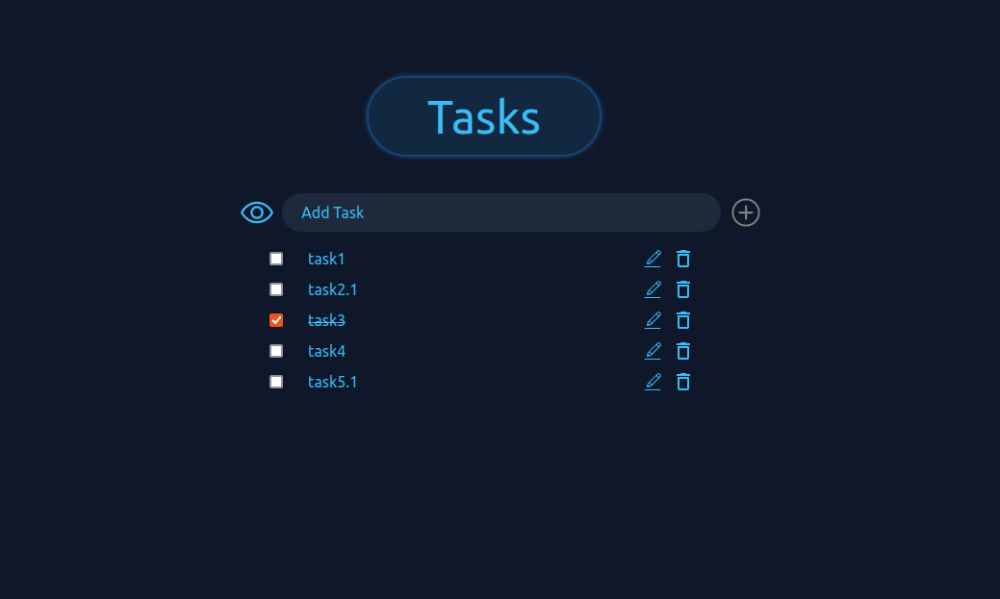

# Project Todo-List named Tasks created using ReactJs, NodeJs, ExpressJs and MongoDB. 

The Frontend created using ReactJs, Backend created using ExpressJs and NodeJs and with MongoDB database.

This project made to practice the concepts of ReactJs, NodeJs, ExpressJs and MongoDB, like how all this libraries works together, how data flows through components and through API, how data renders, how API calls happens, how CURD operations are done on MongoDB. etc.

In current version of code user authentication and login mechanism are not build, so not hosted publically. 

## What you can do -

1. You can save or edit or delete your tasks.
2. You can Show/Hide you completed tasks.

## Some checks which are added in App -

You will not able to save empty tasks.

## Some small details or functionality -

1. If you try to edit or delete, it asks for confirmation.
2. After performing delete or edit or adding new task will give notification to user.
3. Tasks will scroll in given height if more tasks are present than hight of the page. Page will not scroll.
4. If no tasks are available then "No Tasks to Show" message will show below the input.

## Preview

